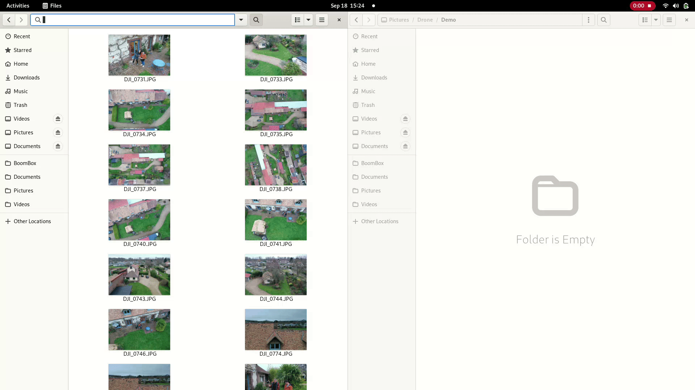

# SymlinkCopy

This project contains two little scripts for nautilus which enable symlinking files as easily as copy / paste.

## Why ?

I use this feature to create photo albums. I have a set of pictures sorted in a certain way, and I want to copy some of them to a new folder which contains all the pictures of the album. However, there's no point in copying the pictures, so symlinking seems faster and mode logical.